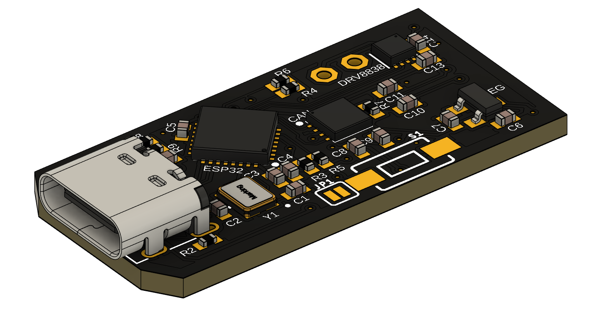
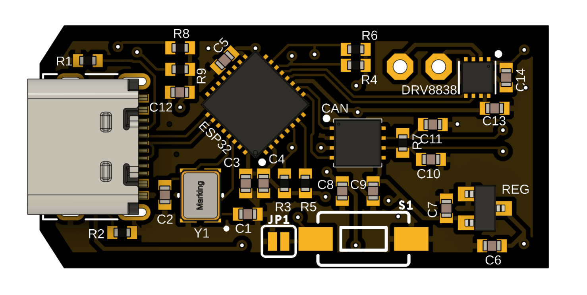
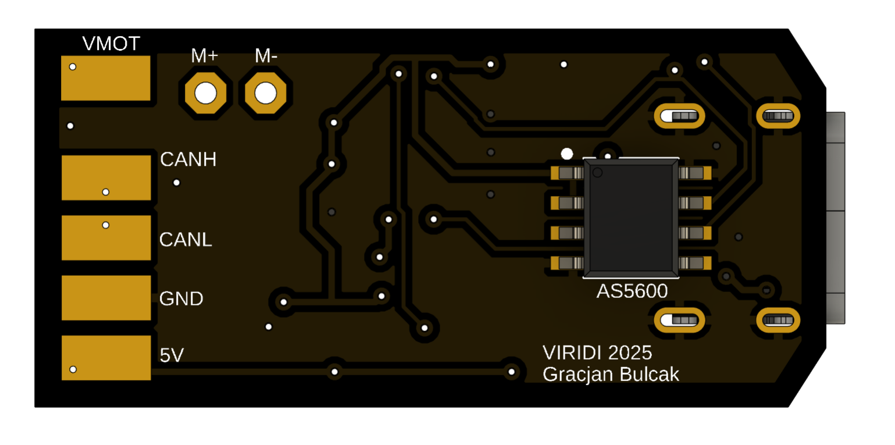

# Servo_CAN_controller
Board allowing to turn DC motors into servomechanisms controlled by CAN bus using ESP32-C3 chip and AS5600 magnetic encoder

</a>

This is the first version of ESP32-C3 microcontroller board with CAN transciever, DC motor driver (DRV8838) and magnetic encoder (AS5600). I will use it to control custom linear actuator.

# PCB layout
</a>
</a>

Top side has USB-C port, ESP32-C3FH4 chip, 40MHz crystal oscillator, CAN transciever module, 3.3V voltage regulator, DRV8838 DC motor driver and all passive components. Bottom side consists of breakout pads for power, ground and CAN lines and AS5600 magnetic ennoder

# Disclaimer
This board is yet to be assembled and tested.

I welcome you to discussion!
